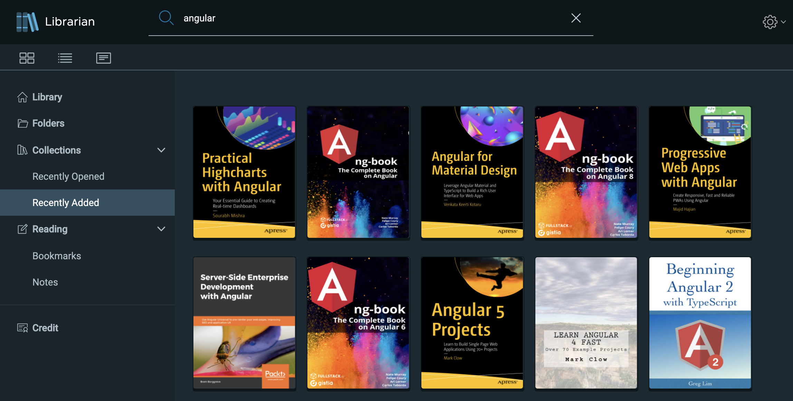
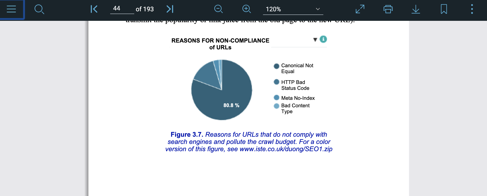

# Librarian

The idea is old as the world. Tons of tools out there, but all lack something.

[Calibre Ebook](https://calibre-ebook.com/) - when I tried it were messing up with directory tree on hdd. Too hard to index keywords from the books. No easy way to open the same library on other devices (mostly mobile). No way to centrally store bookmarks, notes, reading progress and access/search them separately.

[PDF Expert](https://pdfexpert.com/) - could be the perfect solution, but expensive. No way to index book library and search the index. Keep whole library in one place and access from other devices (easy solution, yea yea sshfs, smb, webdav, google drive, etc).

[Polar pdf reader](https://getpolarized.io/) -  really close to what I'd like to have, not designed to be a good standalone app, and upload files and pay for storage when I have them on my HDD already.

Etc many other apps.

So my dream is a small list

* To have a rich annotation system, which can be searched for keywords, books, time, books tags, etc maybe even this one [hypothesis/h](https://github.com/hypothesis/h).
* Have native iOS app
* Have web app with letsencrypt, to make it accessible from home and outside
* One central storage for pdfs/epubs (external HDD on a laptop), files do not transfer to other clients but access directly to avoid data multiplying
* Get as much information about pdf as possible use NLP, find ISBN use amazon/google to find description etc.

The main focus for now is to search books that I have. Because file names quite often useless but I'd like to find book by a specific keyword.

For now, backend can walk trough the directory, find all the pdfs, use NLP to produce tags and main words (tf-idf index), store book's front page and indices in mongodb. And fronted can show and search:




PDF reader is powered by [ngx-extended-pdf-viewer](https://github.com/stephanrauh/ngx-extended-pdf-viewer) which wraps Mozilla PDFjs into angular. For now librarian can save book's latest position: page, zoom, view, rotation and restore it when opened again. Bookmarks are coming,



## Development

### The back end

Back end is [meteor](https://meteor.com) based. To install meteor follow instructions https://www.meteor.com/install or `curl https://install.meteor.com/ | sh`. Back-end code is in `api` directory.

Next commands install npm packages and runs meteor server with internal mongodb. Read meteor documentation how to access mongodb in meteor.
```
cd ./api
meteor npm install
meteor --port 3030 --settings private/settings.json --raw-logs|./node_modules/bunyan/bin/bunyan -L
```

or
```
cd ./api
meteor npm install
npm run api
```
pay attention to `MONGO_URL=mongodb://localhost:27017/bookstorage` env var for mongodb url.


### The front end

The front-end is @angular and [VMware Clarity Design System](https://github.com/vmware/clarity).


```
npm install
npm run start
```

Navigate to `http://localhost:4200/`. The app will automatically reload if you change any of the source files.

The app connect to back-end with Meteor's DDP protocol. Connection settings are in `environment/client-config.js`, for localhost port 3030 use this:
```
    "DDP_DEFAULT_CONNECTION_URL": "http://localhost:3030",
    "ROOT_URL": "http://localhost:3030"
```
